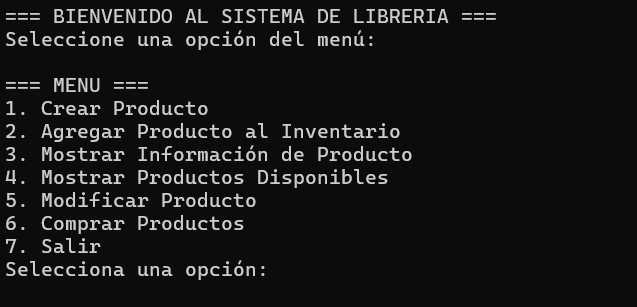
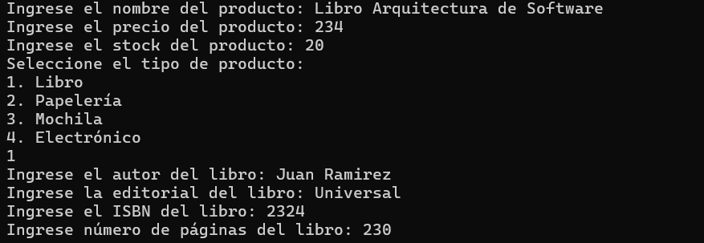

# 📊 Sistema de Gestión de Librería
Este es un sistema de gestión de librería tradicional, permitiendo registrar productos, administrarlos en un inventario, realizar compras y procesar pagos. Todo está basado en una estructura orientada a objetos y puede ser ejecutado fácilmente desde la consola.

Este proyecto está desarrollado en **C#** utilizando el **.NET Framework**, con una interfaz de usuario sencilla basada en la consola.

---

## 🧩 Características del Sistema

🔹 **Gestión de Productos**
- 🎯 Crear distintos tipos de productos: libros, papelería, mochilas y electrónicos
- ✏️ Modificar información básica (nombre, precio, stock)

📦 **Inventario**
- 📥 Insertar productos al inventario
- 🔍 Buscar productos por ID
- 📃 Mostrar todos los productos
- ✅ Filtrar productos con stock disponible

🛒 **Carrito de Compras**
- ➕ Agregar productos al carrito
- ➖ Eliminar productos
- 💵 Calcular total de compra
- 🧾 Visualizar carrito con detalles

💳 **Módulo de Pagos**
- Métodos de pago soportados:
  - 💰 Efectivo
  - 📱 Yape
  - 💳 Tarjeta de Crédito
  - 🏧 Tarjeta de Débito

---

## 🧭 Manual de Usuario

A continuación se detallan las opciones del menú y cómo utilizarlas:



### 📘 1. Crear Producto
Permite ingresar los datos de un producto nuevo. El sistema pregunta por:
- Nombre
- Precio
- Stock
- Tipo de producto (libro, papelería, mochila, electrónico)
- Detalles específicos según el tipo



### 📥 2. Insertar Producto al Inventario
Permite reinsertar productos ya creados en el inventario por su ID. Ideal para duplicados o restocks.

### 🔍 3. Mostrar Información de Producto
Muestra toda la información de un producto específico según su ID, incluyendo atributos detallados como autor, dimensiones, fuente de energía, etc.

### 📋 4. Mostrar Productos Disponibles
Muestra todos los productos almacenados, filtrando por aquellos que tienen stock mayor a 0.

### 🛠️ 5. Modificar Producto
Permite modificar los atributos básicos de un producto existente:
- Nombre
- Precio
- Stock

### 🛒 6. Comprar Productos
Simula el proceso de compra:
- Selecciona productos disponibles
- Agrega al carrito
- Muestra resumen de compra
- Selecciona método de pago

### ❌ 7. Salir
Finaliza el programa.

---

## 💻 Ejecución del Proyecto

### Requisitos
- ✅ .NET 6 o superior
- 💡 Editor de código: Visual Studio / Visual Studio Code

### Pasos

```bash
# Clonar el repositorio
git clone https://github.com/tu-usuario/sistema-libreria-csharp.git

# Acceder al directorio
cd directorio-sistema-librería

# Ejecutar el proyecto
dotnet run
```
---
